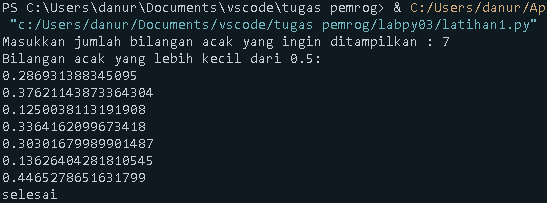
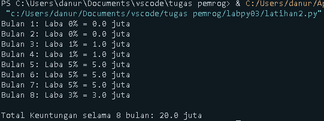
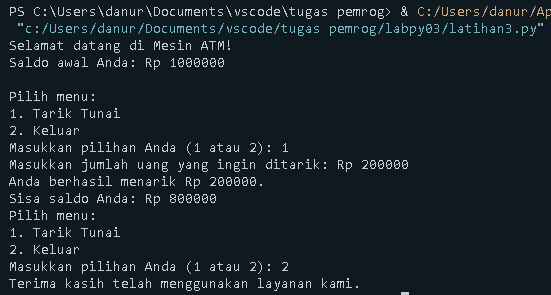

# Latihan1
Menampilkan bilangan (n) acak yang bernilai lebih kecil dari 0.5

---
## Code program 
```python
import random

n = int(input("Masukkan jumlah bilangan acak yang ingin ditampilkan : "))
random_numbers = []

while len(random_numbers) < n:
    number = random.random()
    if number < 0.5:
        random_numbers.append(number)

print("Bilangan acak yang lebih kecil dari 0.5:")
for num in random_numbers:
    print(num)
print("selesai")
```
---
## Output 



---
## Penjelasan Program 
1. Input n: Program meminta pengguna untuk memasukkan jumlah bilangan acak yang ingin dihasilkan.
2. while loop: Program menggunakan while loop untuk terus menghasilkan bilangan acak hingga jumlah bilangan acak yang memenuhi syarat (< 0.5) sebanyak sama dengan n.
3. if statement: Setiap kali bilangan acak dihasilkan, program memeriksa apakah bilangan tersebut kurang dari 0.5. Jika benar, bilangan itu ditambahkan ke dalam list random_numbers.
4. Output: Setelah while loop selesai, program menggunakan for loop untuk menampilkan semua bilangan acak yang disimpan dalam list random_numbers.
---
# Latihan 2 
Menghitung Laba dan keuntungan perusahaan selama 8 bulan 

---
## Code Program 
```python
modal_awal = 100

total_keuntungan = 0

for bulan in range(1, 9): 
    if bulan <= 2:
        laba_persen = 0    
    elif bulan == 3 or bulan == 4:
        laba_persen = 1     
    elif bulan == 5 or bulan == 6 or bulan == 7:
        laba_persen = 5    
    elif bulan == 8:
        laba_persen = 3    
    
    laba_bulan_ini = modal_awal * (laba_persen / 100)
    total_keuntungan += laba_bulan_ini

    print(f"Bulan {bulan}: Laba {laba_persen}% = {laba_bulan_ini} juta")

print("\nTotal Keuntungan selama 8 bulan:", total_keuntungan, "juta")
```
---
## Output program 


---
## Penjelasan Program
1. Modal Awal: Modal awal sebesar 100 juta diinisialisasi dengan variabel modal_awal.
2. Loop 8 Bulan: Program menggunakan for loop dari bulan 1 hingga bulan 8.
    Bulan 1-2: Laba 0%.
    Bulan 3-4: Laba 1%.
    Bulan 5-7: Laba 5%.
    Bulan 8: Laba turun menjadi 3%.
3. Menghitung Laba: Setiap bulan, laba dihitung berdasarkan persentase laba untuk bulan tersebut.
4. Mengakumulasi Laba: Keuntungan bulan ini ditambahkan ke total_keuntungan.
5. Output: Program menampilkan keuntungan per bulan dan total keuntungan setelah 8 bulan.
---

# latihan 3
Membuat program ATM yang memungkinkan pengguna menarik uang sesuai nominal yang di input

---
## Code Program 
```python
saldo = 1000000

print("Selamat datang di Mesin ATM!")
print(f"Saldo awal Anda: Rp {saldo}\n")

while True:
    print("Pilih menu:")
    print("1. Tarik Tunai")
    print("2. Keluar")
    
    pilihan = input("Masukkan pilihan Anda (1 atau 2): ")

    if pilihan == '1':
        jumlah_tarik = int(input("Masukkan jumlah uang yang ingin ditarik: Rp "))

        if jumlah_tarik > saldo:
            print("Maaf, saldo Anda tidak mencukupi.")
        elif jumlah_tarik <= 0:
            print("Jumlah penarikan tidak valid.")
        else:
            saldo -= jumlah_tarik
            print(f"Anda berhasil menarik Rp {jumlah_tarik}. \nSisa saldo Anda: Rp {saldo}")
            
            if saldo == 0:
                print("Saldo Anda habis. Terima kasih telah menggunakan layanan kami.")
                break

    elif pilihan == '2':
        print("Terima kasih telah menggunakan layanan kami.")
        break
    else:
        print("Pilihan tidak valid. Silakan pilih 1 atau 2.")
```
---

## Output 


---
## Penjelasan program 
1. Saldo Awal: Program dimulai dengan saldo awal Rp 1.000.000.
2. Loop Menu: Menggunakan loop while untuk terus menampilkan pilihan menu sampai pengguna memilih keluar atau saldo habis.
3. Tarik Tunai:
    -Memeriksa apakah jumlah yang diminta melebihi saldo atau kurang dari atau sama dengan nol.
    -Jika jumlah valid, saldo dikurangi dan ditampilkan.
    -Jika saldo habis, program otomatis keluar.
4. Keluar: Jika pengguna memilih 2, program keluar.

---
